# 错题本知识溯源整理助手 · 软件使用说明

> 版本：v3.1
> 适用对象：学生个人用户、毕业设计验收与演示  
> 演示账号：`demo`  
> 演示密码：`demo123`

---

## 1. 系统简介

错题本知识溯源整理助手是一款本地运行的错题管理工具。系统围绕“错题 → 知识点 → 薄弱分析 → 复习计划”的闭环设计，支持拍照识别、PDF/Word 导入、AI 知识点推荐、知识图谱、复习计划、学习资源和统计报表。

---

## 2. 启动与登录

### 2.1 启动系统

Windows 推荐直接双击项目根目录的 `启动错题本.bat`。脚本会自动查找 Python、检查依赖、启动服务并打开浏览器。

```bash
python app.py
```

浏览器访问：`http://localhost:5000`

### 2.2 登录界面

首次进入系统需要登录。账号和密码只允许使用英文字母和数字。

演示账号：

- 账号：`demo`
- 密码：`demo123`

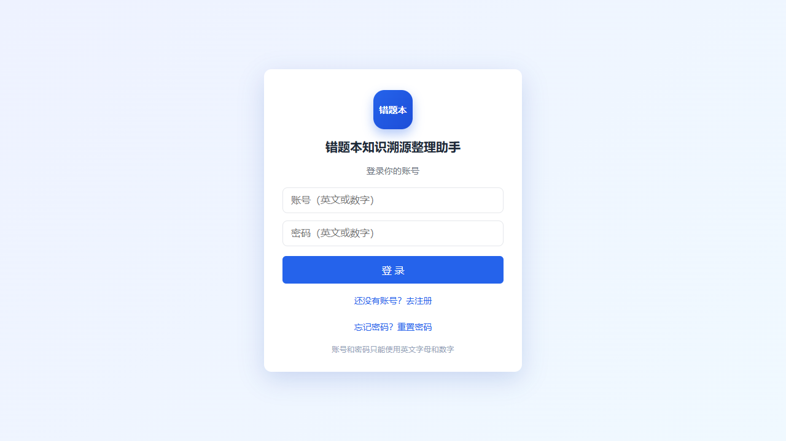

登录页支持：

- 注册新账号
- 登录已有账号
- 忘记密码后重置密码

### 2.3 手机安装与离线查看

在 `localhost` 或 HTTPS 地址打开系统后，可以使用浏览器菜单中的“添加到主屏幕”。安装后可以像 App 一样打开，断网时仍能查看已缓存的错题和首页数据。

账号切换或退出登录时，当前账号的离线数据会自动清理，避免多人共用一个手机时数据串用。

---

## 3. 首页概览

登录后进入首页，可以看到：

- 总错题数
- 未掌握错题数
- 薄弱知识点 TOP3
- 最近录入的错题

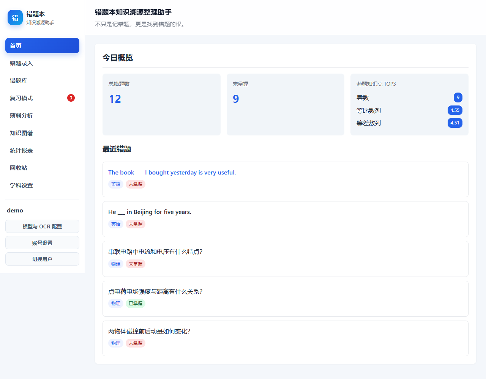

左侧为垂直导航栏，按常用程度排列：

`首页 → 错题录入 → 错题库 → 复习模式 → 薄弱分析 → 知识图谱 → 统计报表 → 回收站 → 学科设置`

左下角包含：

- 当前用户
- 模型与 OCR 配置
- 账号设置
- 切换用户

---

## 4. 错题录入

在“错题录入”页面可以手动录入错题，也可以拍照或导入试卷。

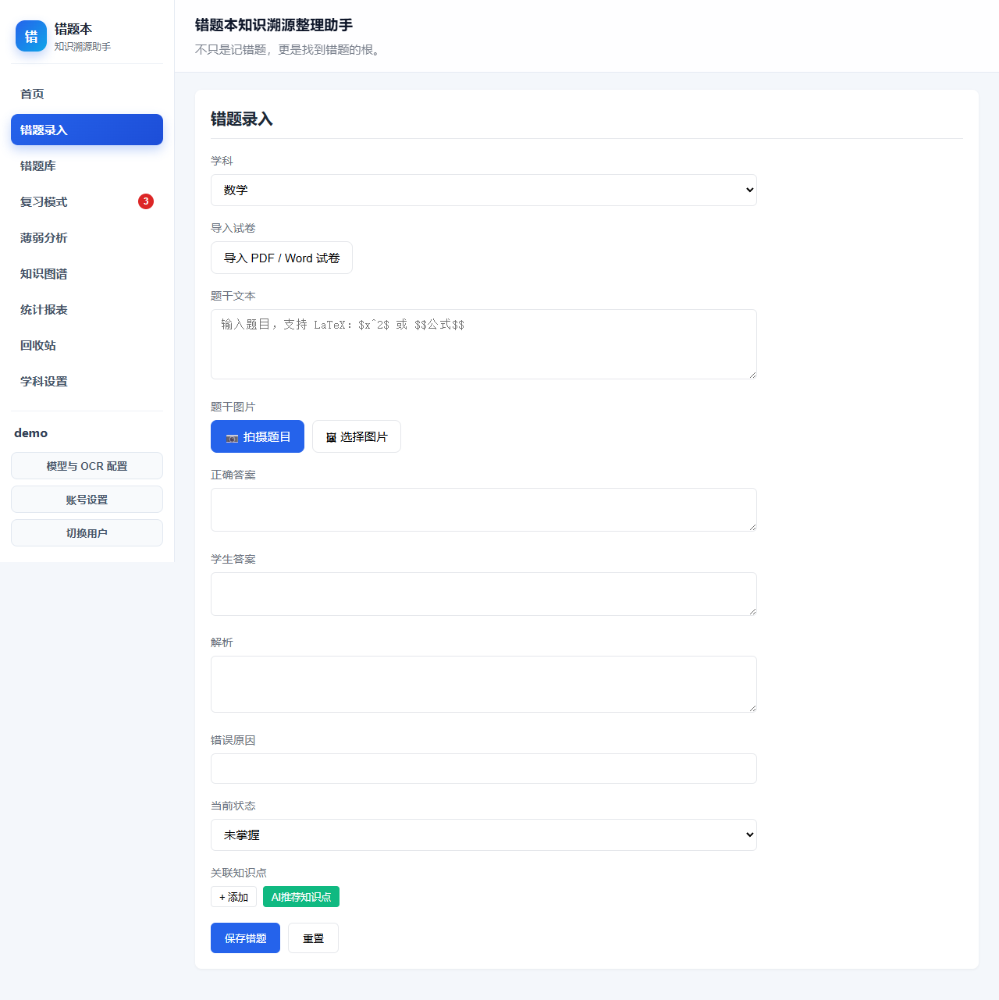

### 4.1 手动录入

填写以下内容：

1. 学科
2. 题干文本
3. 题干图片（可选）
4. 正确答案
5. 学生答案
6. 解析
7. 错误原因
8. 当前状态
9. 关联知识点

题干支持 LaTeX 公式，例如：

```text
$x^2$
$$\frac{a}{b}$$
```

输入后会实时显示公式渲染预览。

### 4.2 拍照识别

点击“拍摄题目”或“选择图片”：

1. 系统调用摄像头或选择本地图片。
2. 自动调用 PaddleOCR 识别文字。
3. 识别结果自动填入题干。
4. 用户可以手动修改识别结果。

### 4.3 导入 PDF / Word

点击“导入 PDF / Word 试卷”：

1. 选择 PDF、DOC 或 DOCX 文件。
2. 文字版文档直接提取文本。
3. 扫描版 PDF 自动转为图片并调用 OCR。
4. 系统按题号自动分题。
5. 在预览窗口勾选、修改题目。
6. 点击“确认导入”批量入库。

### 4.4 保存确认

点击“保存错题”后，系统会再次确认，防止误操作。

---

## 5. 错题管理

进入“错题库”可以管理和筛选所有错题。

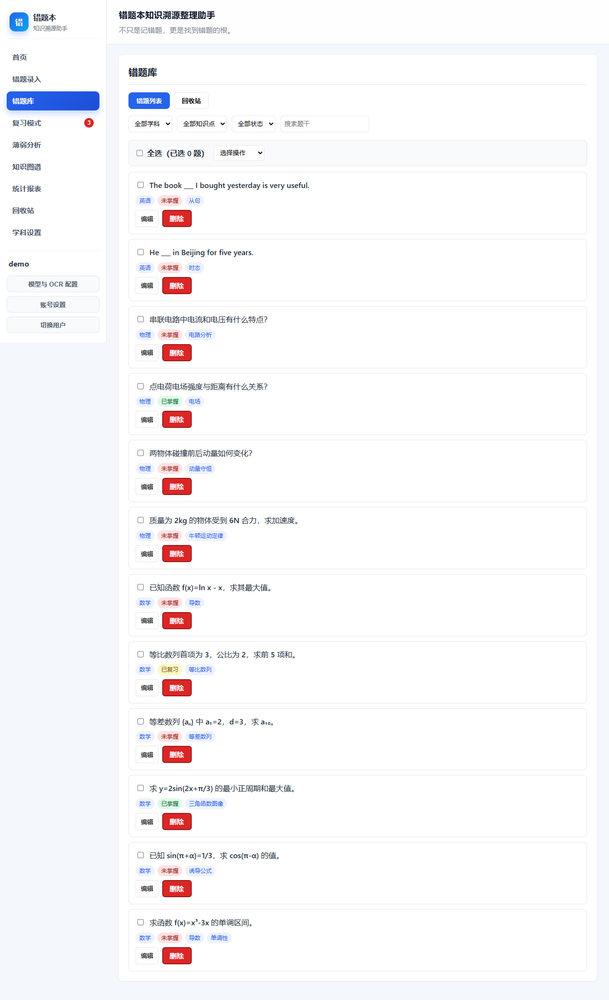

### 5.1 筛选

支持按以下条件筛选：

- 学科
- 知识点
- 错题状态
- 题干关键词

错题库使用后端分页加载，默认每页 20 题。搜索结果和筛选结果会自动回到第 1 页。

### 5.2 批量操作

勾选多道错题后，可以选择一个统一操作：

- 关联知识点
- 修改状态
- 删除

### 5.3 查看和编辑

点击题目标题查看详情：

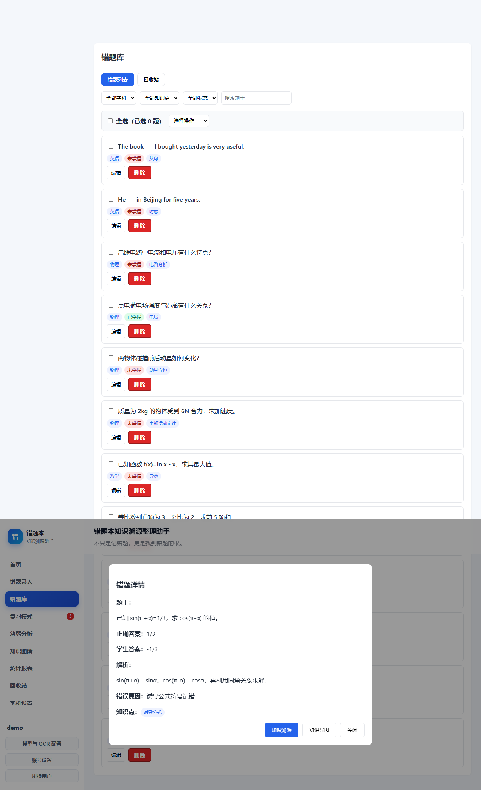

详情页支持：

- 查看题目、答案、解析
- 编辑错题
- 知识溯源
- 查看知识导图

---

## 6. 知识溯源与思维导图

在错题详情或复习单题页点击“知识溯源”：

1. 系统调用大模型分析错题。
2. 输出错误表象、直接知识点、前置知识点和根本原因。
3. 用户勾选认可的知识点。
4. 点“生成知识溯源导图”。
5. 系统生成独立的思维导图。

思维导图支持：

- 删除节点
- 添加自定义节点
- 保存导图
- 后续重新打开查看

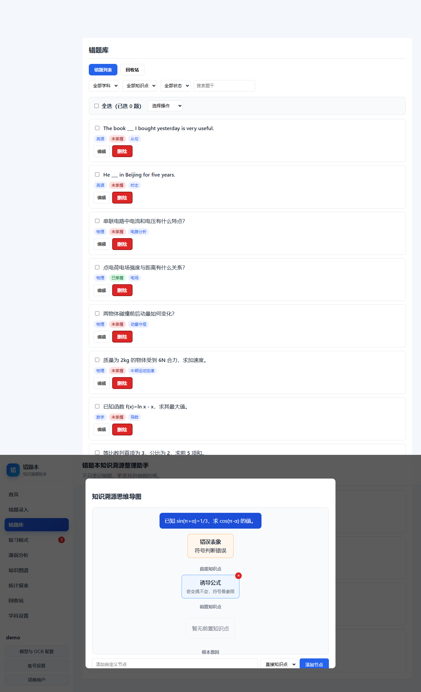

注意：知识溯源生成的内容只进入思维导图，不会污染知识树。

---

## 7. 复习模式

“复习模式”用于安排和完成复习任务。

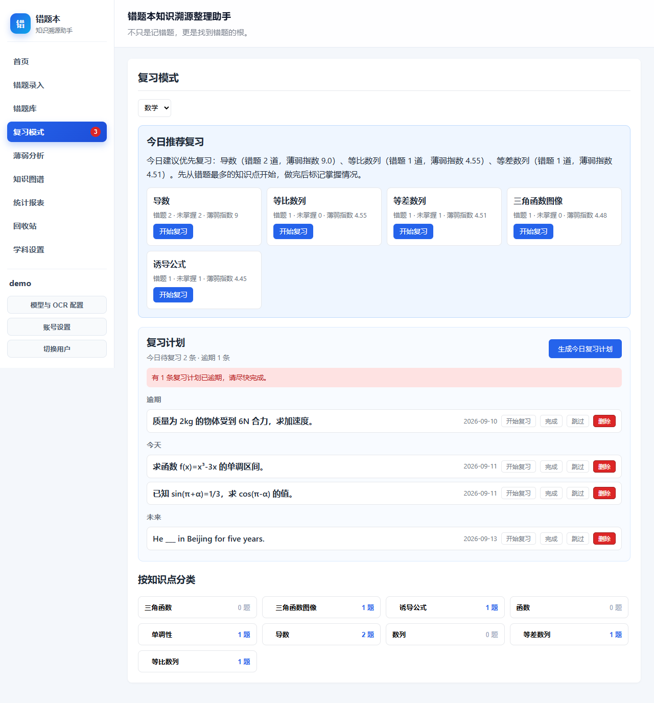

### 7.1 今日推荐

系统根据薄弱知识点和错题情况，推荐今天优先复习的知识点。

### 7.2 复习计划

支持两种计划方式：

1. 点击“生成今日复习计划”，系统自动生成当天计划。
2. 在单题复习页点击“加入复习计划”，自定义复习日期和备注。

计划按以下分组展示：

- 逾期
- 今天
- 未来
- 已完成 / 已跳过

每条计划可以执行：

- 开始复习
- 完成
- 跳过
- 删除

### 7.3 复习提醒与日历

- 点击“开启浏览器提醒”并允许通知权限
- 设置每日提醒时间
- 页面保持打开时，到达提醒时间会弹出浏览器通知
- 点击“导出日历”下载 `.ics` 文件，可加入手机系统日历

局域网普通 HTTP 地址可能无法使用系统通知，此时建议使用 `.ics` 日历导出。

### 7.4 单题复习

点击错题进入单题复习页面，可以：

- 查看题目
- 选择是否显示答案
- 标记“已掌握”
- 标记“仍需加强”
- 请求 AI 解答
- 生成知识溯源导图

AI 解答采用逐字流式显示，不需要等待完整内容生成。

---

## 8. 薄弱分析

“薄弱分析”页面用于查看学科薄弱点和错误趋势。

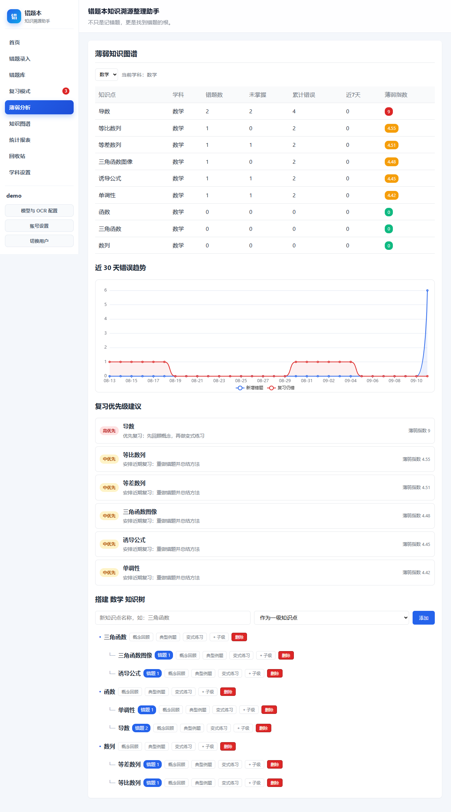

包含：

- 薄弱知识点 TOP-N
- 累计错误次数
- 近 7 天重复错误
- 薄弱指数排行
- 近 30 天错误趋势折线图
- 复习优先级建议

薄弱指数采用：

```text
错题数量 × 0.4
+ 累计错误次数 × 0.3
+ 时间衰减 × 0.2
+ 近 7 天重复犯错 × 0.1
```

最终换算为 0～10 的分数。

---

## 9. 知识图谱

知识图谱以学科为中心，按层级向外展示知识点。

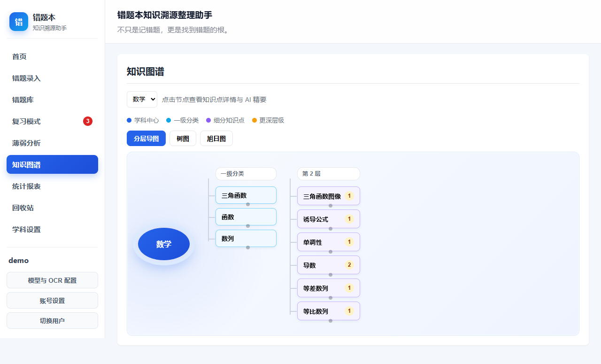

支持三种视图：

### 9.1 分层导图

适合查看学科 → 一级知识点 → 二级知识点的层级关系。

### 9.2 树图

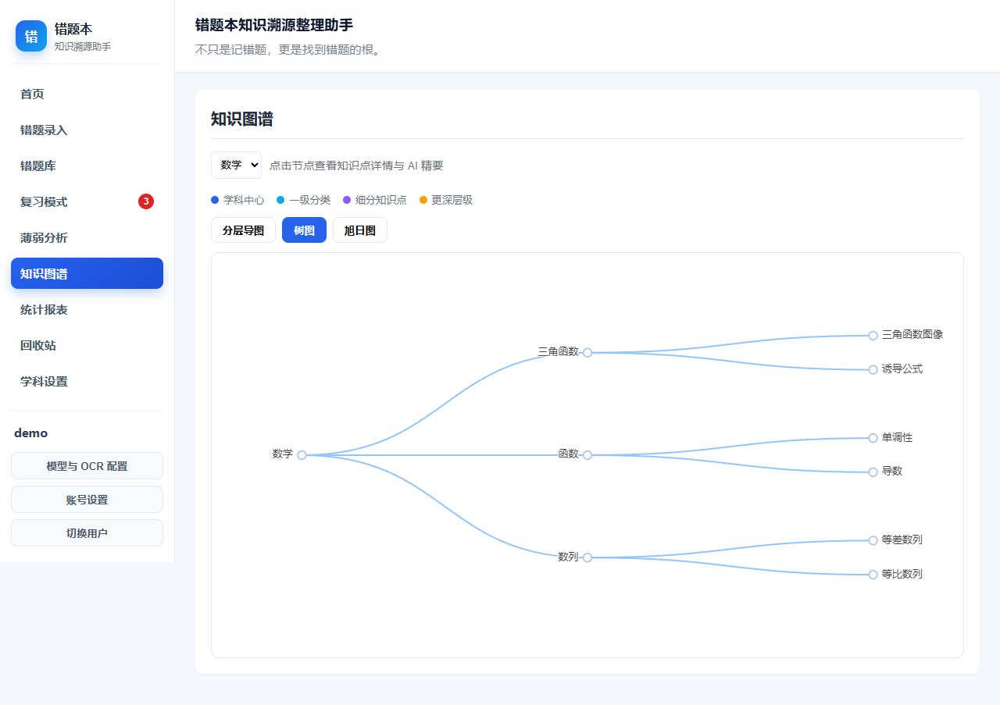

### 9.3 旭日图

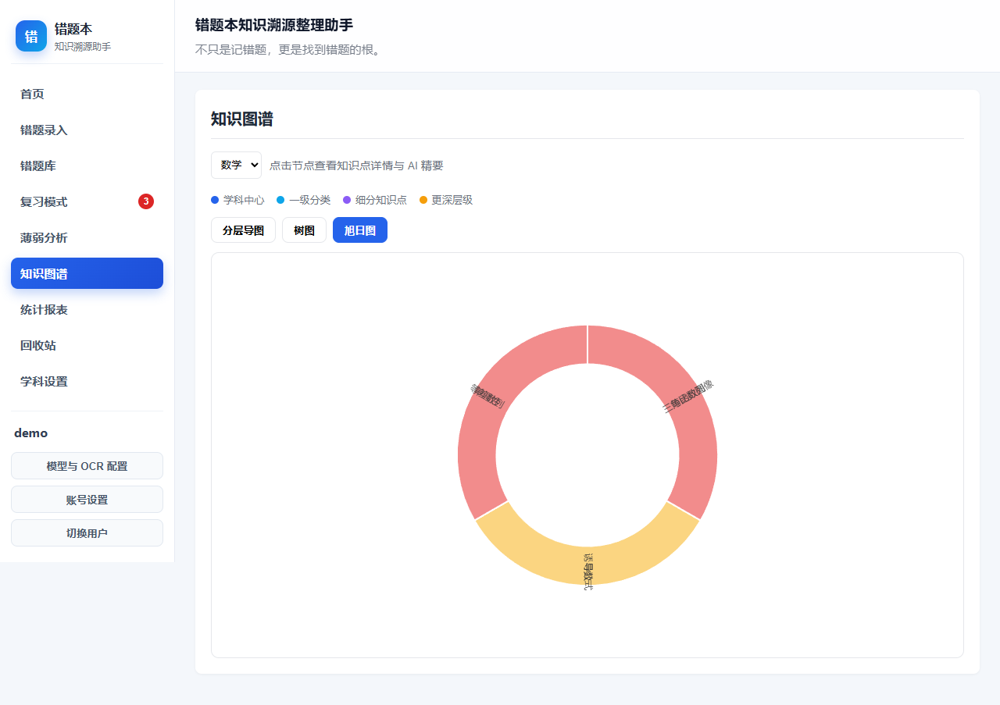

点击任意节点可以查看：

- 知识点说明
- 已保存的知识库内容
- 学习资源
- AI 精简知识点

知识点说明和知识库内容支持手动编辑、保存和删除。

---

## 10. 学习资源

知识点详情中的“学习资源”分为两块：

### 10.1 AI 推荐

AI 推荐包含：

- B站网课搜索链接
- 复习笔记内容

不会编造教材页码和视频 BV 号。

### 10.2 我的学习资源

支持用户自己新增：

- 教材页码
- 网课链接
- 笔记内容
- 附件上传

所有资源都可以修改和删除。

---

## 11. 统计报表

“统计报表”展示整体学习情况。

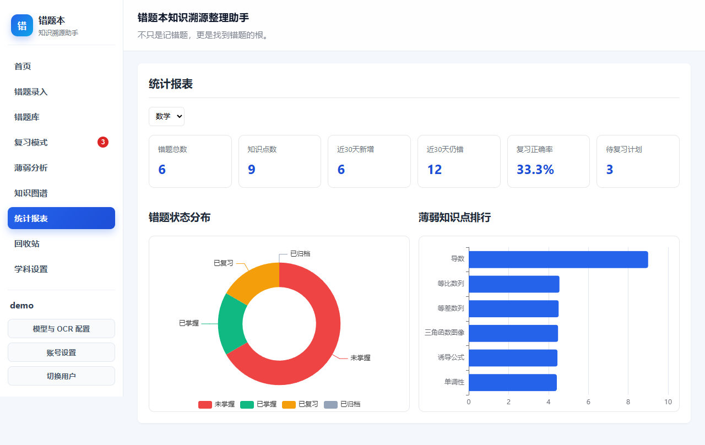

包含：

- 错题总数
- 知识点数
- 近 30 天新增错题
- 近 30 天复习仍错
- 复习正确率
- 待复习计划数量
- 错题状态分布环形图
- 薄弱知识点排行柱状图

页面右上区域提供“导出 Word”和“导出 PDF”按钮，可导出统计报表、薄弱分析和复习计划，适合论文附录或答辩材料。

---

## 12. 回收站

删除错题后不会直接永久删除，而是进入回收站。

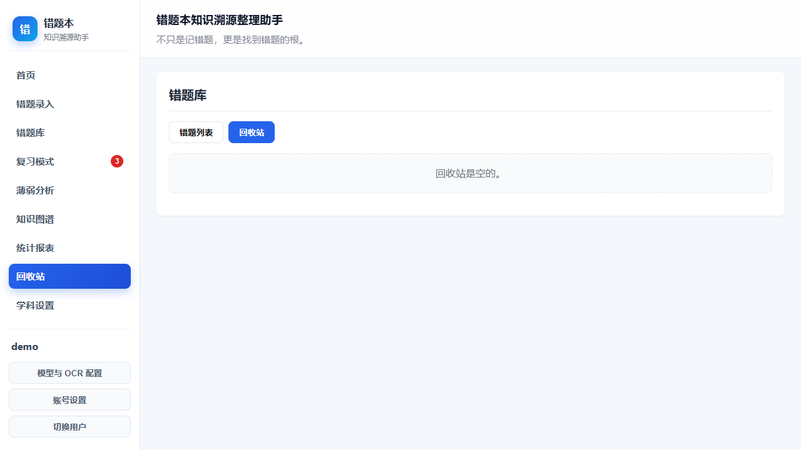

回收站支持：

- 恢复错题
- 彻底删除

彻底删除后无法恢复。

---

## 13. 学科设置

“学科设置”用于管理学科和知识点树。

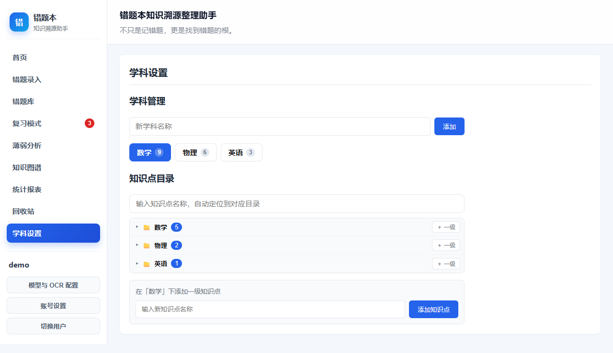

支持：

- 新增学科
- 删除学科
- 新增一级知识点
- 添加子知识点
- 删除知识点
- 搜索知识点并自动定位目录
- 点击知识点查看详情

知识树只保存精简的知识点名称，详细内容放在知识点详情和知识库中。

---

## 14. 账号设置

点击左下角“账号设置”：

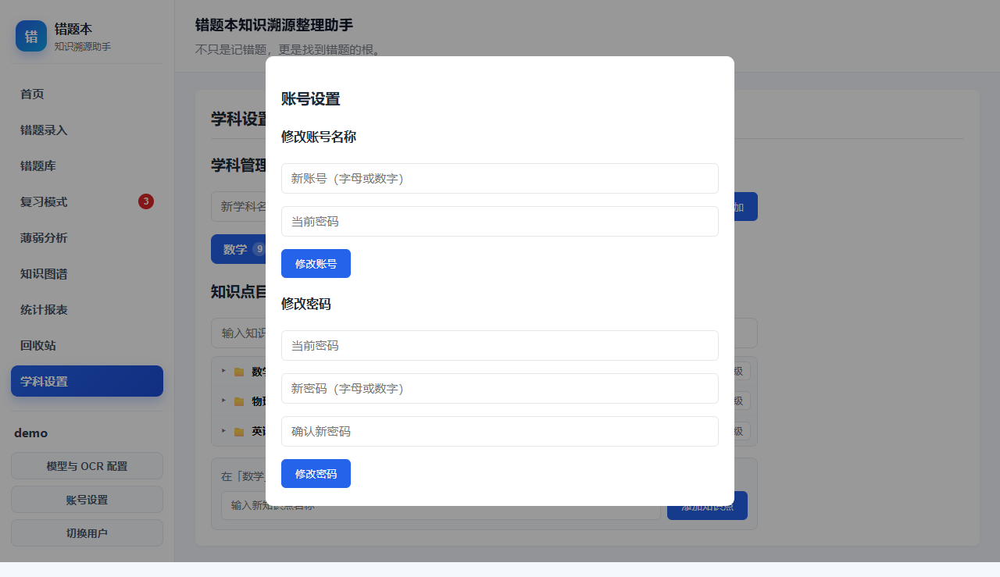

可以：

- 修改账号名称
- 修改密码
- 导出数据包
- 导入数据包
- 永久删除账号

数据包为单个 `.zip` 文件，内含完整备份，导入时也只需要选择这一个文件。

---

## 15. 模型与 OCR 配置

点击左下角“模型与 OCR 配置”：

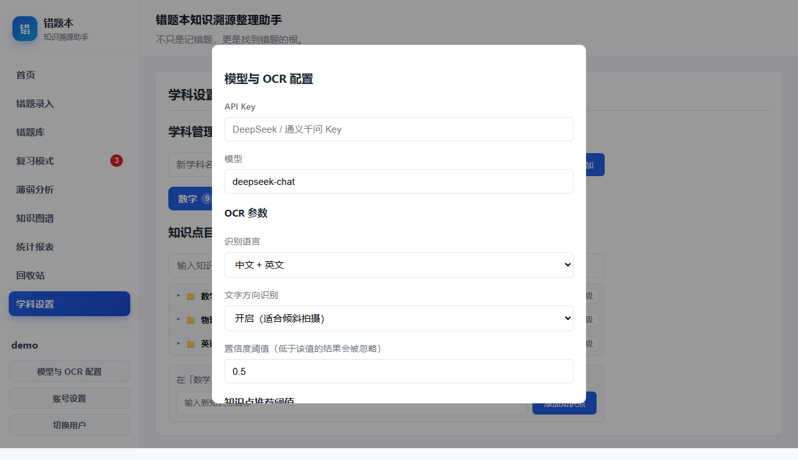

### 15.1 大模型配置

- API Key
- 模型名称

用于：

- 知识点推荐
- 知识溯源
- 概念回顾
- 典型例题
- 变式练习
- AI 解答
- AI 精简知识点
- AI 推荐学习资源

### 15.2 知识点推荐阈值

- 自动绑定阈值
- 待确认阈值

### 15.3 OCR 配置

- 识别语言
- 文字方向识别
- 置信度阈值

---

## 16. 常见问题

### 16.1 公式显示不正常

题干中使用 LaTeX 格式，例如 `$x^2$`。系统会实时渲染公式。

### 16.2 OCR 识别失败

请检查：

1. PaddleOCR 是否安装正常。
2. 识别语言是否正确。
3. 图片是否清晰。
4. 置信度阈值是否设置过高。

### 16.3 AI 功能提示未配置

点击左下角“模型与 OCR 配置”，填写大模型 API Key。

### 16.4 数据会不会丢失

数据保存在本地 SQLite 文件中。建议定期在“账号设置”中导出数据包。

### 16.5 手机不能安装或通知

完整 PWA 安装和浏览器通知通常要求 HTTPS 或 localhost。通过局域网 IP 使用普通 HTTP 时，可以使用页面功能，但不能保证系统级安装和通知；复习计划仍可通过 `.ics` 导入手机日历。

---

## 17. 演示视频

演示视频文件：

[demo_video.webm](../output/playwright/video/demo_video.webm)
